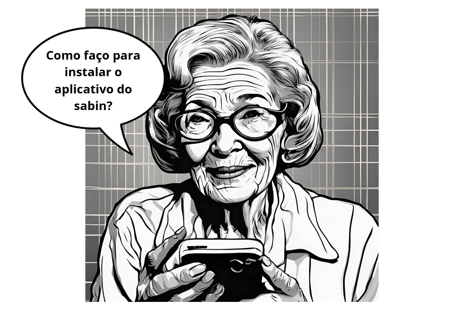

# APPS

Esta seção é destinada para a elicitação dos requisitos relacionados à área de Apps da Play Store, esta categoria foi definida na secção [Home](../home/home.md).

## [Introspecção](tecnicas.md#introspeccao)

O artefato está definido em [introspecção](tecnicas.md#introspeccao)

### Funcionalidades Gerais

1. Mostrar os aplicativos mais bem avaliados
2. Mostrar os aplicativos mais vendidos
3. Separar aplicativos em categorias
4. Mostrar aplicativos em alta
5. Menu Kids 
    - Separar por idades
    - Aplicativos aprovados por professores

### Detalhes do Aplicativo

6. Mostrar informações detalhadas do aplicativo
    - Informações gerais
    - Fotos
    - Avaliações
    - Aplicativos semelhantes

### Informações Adicionais

7. Mostrar empresa desenvolvedora
8. Nome do aplicativo
9. Indicar se contém propagandas ou compras internas
10. Classificação etária
11. Número de downloads feitos
12. Tamanho do aplicativo
13. Classificação do aplicativo
14. Segurança de dados
    - Dados compartilhados
    - Dados coletados
    - Práticas de segurança
    - Exclusão de dados

### Informações sobre Avaliações

15. Sobre o aplicativo
16. Quantidade de avaliações
17. Mostrar avaliações
18. Permitir avaliação do aplicativo
19. Filtrar avaliações
20. Marcar como inapropriado

### Funcionalidades Personalizadas

21. Recomendar aplicativos de acordo com o perfil do usuário
22. Instalar, desinstalar e atualizar aplicativos
23. Pesquisa de aplicativos
    - Salvar pesquisas recentes
    - Pesquisa por voz

### Funcionalidades de Navegação

24. Histórico de aplicativos
25. Mostrar eventos de um aplicativo
26. Lista de desejos
27. Compartilhar aplicativo

### Notificações e Filtros

28. Notificações de atualização ou aplicativos parecidos
29. Filtrar aplicativos

## [Storytelling](tecnicas.md#storytelling)

O artefato está definido em [storytelling](tecnicas.md#storytelling)

**Personagens**: Dona Maria é uma senhora aposentada de 75 anos, que deseja baixar o aplicativo do Sabin para conferir os resultados de seus exames. Ela apresenta dificuldades de locomoção, por isso seria mais fácil se pudesse olhar os exames pelo celulaar, ao invés de fazer outra visita ao laboratório.

**Problema**: Dona Maria geralmente pede ajuda aos filhos ou netos para mexer com tecnologia, mas, desta vez, ela está sozinha em casa.

**Cenário 1**:
Ações: Ela abre o celular e busca pela PlayStore. Sua primeira ação é tentar rolar a tela e explorar o aplicativo, sem saber exatamente como fazer. Ela encontra a categoria Saúde e, por acaso, vê o ícone do Sabin e consegue instalar.

**Cenário 2**:
Ações: Ela abre o celular e busca pela PlayStore. Ela observa o símbolo de pesquisa no topo da página e busca pelo Sabin. Ao encontrar o app, ela clica no botão azul de instalar e finaliza seu processo. 

**Possível solução**: O app deveria possuir um tutorial básico para usuários novos, ou usuários com menos experiência com tecnologia, destacando a barra de pesquisa e as abas de categorias recomendadas.

*Autores: Cecília Quaresma & Hugo Queiroz*

## [Análise de protocolo](tecnicas.md#analise-de-protocolo)

O artefato está definido em [análise de protocolo](tecnicas.md#analise-de-protocolo)

### Aplicação
Escolhemos uma ação que ainda não havia sido analisada na categoria de Apps e realizamos uma análise de protocolo. Enquanto um integrante utilizava o aplicativo, outro anotava e analisava os passos.

### Resultados
Observamos que ainda não tínhamos analisado a parte de gerenciamento de Apps por dispositivo, uma funcionalidade disponível na Play Store. Aplicamos a técnica e verificamos que era possível instalar um aplicativo em um dispositivo por meio de outro dispositivo usando a plataforma web.

[Vídeo da aplicação da Análise de protocolo - 12/08/2024 ](https://drive.google.com/file/d/1dujdWX5reqy406u1oGvMoWOQ-NWWkRLl/view?usp=sharing)

## Requisitos elicitados para apps

| Requisito | Descrição | Técnica |
| :--: | :-- | :--: |
| REQ01 | O Sistema deve ser capaz de mostrar os apps mais bem avaliados | Introspecção |
| REQ02 | O Sistema deve ser capaz de mostrar os apps mais vendidos | Introspecção |
| REQ03 | O Sistema deve ser capaz de separar os apps em categorias | Introspecção |
| REQ04 | O Sistema deve ser capaz de mostrar apps em alta | Introspecção |
| REQ05 | O Sistema deve ter uma área kids | Introspecção |
| REQ06 | O Sistema deve mostrar informações relevantes dos apps disponiveis| Introspecção |
| REQ07 | O Sistema deve recomendar apps de acordo com o perfil do usuário | Introspecção |
| REQ08 | O Sistema deve permitir Instalar apps | Introspecção |
| REQ09 | O Sistema deve permitir desinstalar apps | Introspecção |
| REQ10 | O Sistema deve permitir atualizar apps já instalados | Introspecção |
| REQ11 | O Sistema deve permitir a pesquisa de apps | Introspecção |
| REQ12 | O Sistema deve mostrars notificações de atualização e recomendação de apps parecidos | Introspecção |
| REQ13 | O Sistema deve salvar pesquisas recentes | Introspecção |
| REQ14 | O Sistema deve manter um histórico de apps já instalados | Introspecção |
| REQ15 | O Sistema deve permitir a criação de uma lista de desejos | Introspecção |
| REQ16 | O Sistema deve mostrar eventos de um app | Introspecção |
| REQ17 | O Sistema deve permitir compartilhar app | Introspecção |
| REQ18 | O Sistema deve permitir a avaliação de um app | Introspecção |
| REQ19 | O Sistema deve permitir marcar um app como inapropriado | Introspecção |
| REQ20 | O Sistema deve ter um tutorial básico para novos usuarios | StoryTelling |
| REQ21 | O Sistema tem que ser acessível para pessoas idosas | StoryTelling |
| REQ22 | O Sistema deve ser capaz de mostrar os apps disponíveis para um dispositivo | Análise de protocolo |
| REQ23 | O Sistema deve ser capaz de instalar apps em outros dispositivos |Análise de protocolo |
| REQ24 | O Sistema deve categorizar os aplicativos por idade na área kids | Introspecção |

## Histórico de Versões
 
| **Versão** | **Data** | **Alterações Principais** | **Autor** |
| :--: | :--: | :--: | :--: | 
| 1.0.0 | 26-07-2024 | Criação do documento e adicionando requisitos | Cecília Quaresma & Hugo Queiroz |
| 1.0.1 | 29-07-2024 | Adicionando storytelling e altera introspecção | Cecília Quaresma & Hugo Queiroz |
| 1.0.2 | 31-07-2024 | Padronizando arquivo | Cecília Quaresma & Hugo Queiroz |
| 1.0.3 | 12-08-2024 | Adicionando Análise de protocolo | Carlos Alves & Larissa Vieira |