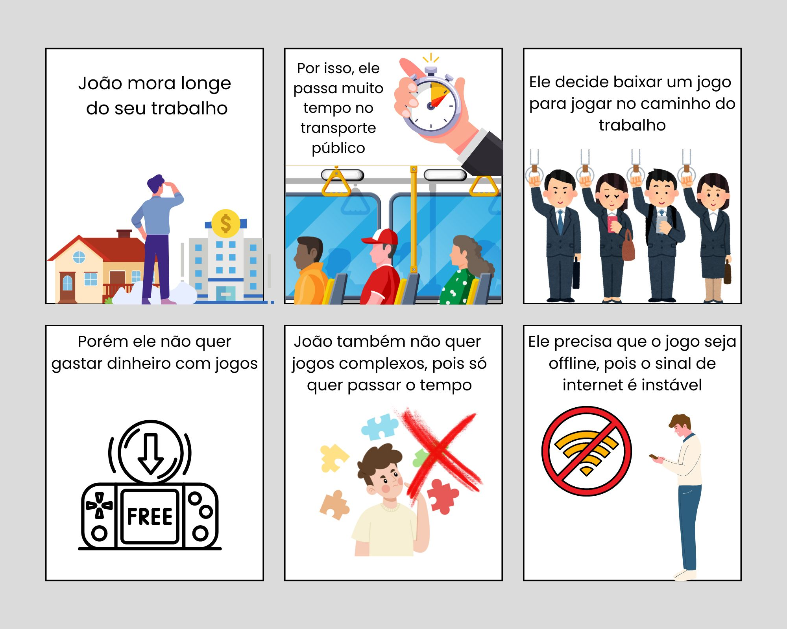
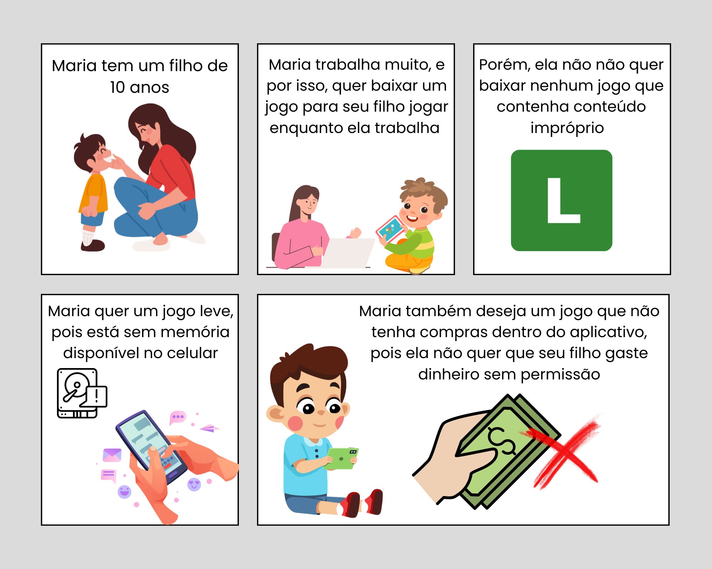

# Jogos

Esta seção é destinada para a elicitação dos requisitos relacionados à área de Jogos da Play Store.

## Histórico de Versões

| Versão | Data       | Alterações Principais                                          | Autor                        |
| ------ | ---------- | -------------------------------------------------------------- | ---------------------------- |
| 1.0    | 29-07-2024 | Adição de Rich Picture para a área de jogos                    | Arthur Sousa e Lucas Queiroz |
| 1.0.1  | 29-07-2024 | Adiciona mais informações sobre a área de jogos                | Arthur Sousa e Lucas Queiroz |
| 1.0.2  | 29-07-2024 | Adiciona arquivos de áudio da análise de protocolo             | Arthur Sousa e Lucas Queiroz |
| 1.0.3  | 29-07-2024 | Adiciona quadrinhos gerados a partir do Storytelling           | Arthur Sousa e Lucas Queiroz |
| 1.0.4  | 29-07-2024 | Adiciona tabela com requisitos elicitados                      | Arthur Sousa e Lucas Queiroz |
| 1.0.5  | 31-07-2024 | Realiza divisão do arquivo em elicitação e pré-rastreabilidade | Arthur Sousa e Lucas Queiroz |

## Análise de protocolo
(inserir link para explicação da técnica)

### Arquivos de áudio
[Clique aqui para acessar um diretório no Google Drive com os arquivos de áudio.](https://drive.google.com/drive/folders/18ZcscWDNY1OUcLuZcanFcm-xrGkef79p?usp=sharing)

## Storytelling

### História 1

- João trabalha em uma empresa longe de sua casa e, por conta disso, passa muito tempo em transportes públicos. Ele decide buscar um jogo que pudesse jogar no caminho para o trabalho. Porém, ele não quer gastar dinheiro com jogos. João também não quer jogos que sejam muito complexos, pois ele quer algo para passar o tempo e se distrair. Por fim, ele quer um jogo que possa jogar offline, pois o sinal de internet no transporte público é instável.

### História 2

- Maria é uma mãe que tem um filho de 10 anos. Maria passa muito tempo trabalhando, e por isso, ela decide procurar um jogo para que seu filho possa jogar no celular. Porém, ela não quer baixar nenhum jogo que contenha conteúdos impróprios para o seu filho. Além disso, Maria não tem muito espaço disponível no celular, então ela quer um jogo que não ocupe muito espaço. Maria também deseja um jogo que não tenha compras dentro do aplicativo, pois ela não quer que seu filho gaste dinheiro sem permissão (ou acidentalmente).

## Requisitos elicitados

| Código | Descrição                                                                                      | Técnica de elicitação |
| ------ | ---------------------------------------------------------------------------------------------- | --------------------- |
| REQ01  | O usuário deve poder buscar por um jogo                                                        | Análise de protocolo  |
| REQ02  | O sistema deve dividir jogos em categorias                                                     | Análise de protocolo  |
| REQ03  | O usuário deve poder instalar um jogo                                                          | Análise de protocolo  |
| REQ04  | O usuário deve poder desinstalar um jogo                                                       | Análise de protocolo  |
| REQ05  | O usuário deve poder atualizar um jogo                                                         | Observação            |
| REQ06  | O usuário deve poder desinstalar um jogo                                                       | Análise de protocolo  |
| REQ07  | O usuário deve poder avaliar um jogo                                                           | Análise de protocolo  |
| REQ08  | O sistema deve apresentar a classificação indicativa dos jogos                                 | Storytelling          |
| REQ09  | O usuário deve poder ver as últimas novidades de um jogo                                       | Análise de protocolo  |
| REQ10  | O usuário deve poder ver quanto espaço um jogo ocupa no armazenamento interno                  | Storytelling          |
| REQ11  | O usuário deve poder ver as últimas novidades de um jogo                                       | Análise de protocolo  |
| REQ12  | O sistema deve apresentar jogos similares a um jogo que está em foco pelo usuário              | Análise de protocolo  |
| REQ13  | O sistema deve apresentar o progresso do download de um jogo                                   | Análise de protocolo  |
| REQ14  | O usuário deve poder executar um jogo a partir da Play Store                                   | Análise de protocolo  |
| REQ15  | O sistema deve apresentar as ofertas de compra que existem num jogo                            | Análise de protocolo  |
| REQ16  | O sistema deve apresentar quais são os eventos que estão ocorrendo num jogo                    | Análise de protocolo  |
| REQ17  | O usuário deve poder escrever uma resenha de um jogo                                           | Análise de protocolo  |
| REQ18  | O sistema deve fornecer o contate para suporte com os desenvolvedores de um jogo               | Análise de protocolo  |
| REQ19  | O sistema deve fornecer a política de privacidade de um jogo                                   | Análise de protocolo  |
| REQ20  | O sistema deve fornecer um tutorial de como o jogo funciona                                    | Análise de protocolo  |
| REQ21  | O sistema deve mostrar quando um jogo foi atualizado pela última vez e qual é sua atual versão | Análise de protocolo  |
| REQ22  | O sistema deve mostrar a quantidade de downloads que um jogo tem                               | Análise de protocolo  |
| REQ23  | O sistema deve mostrar em quais sistemas operacionais um jogo pode ser executado               | Análise de protocolo  |
| REQ24  | O sistema deve mostrar quais são as compras possíveis dentro de um jogo, caso existam          | Storytelling          |
| REQ25  | O sistema deve mostrar qual a empresa criadora do jogo                                         | Análise de protocolo  |
| REQ26  | O sistema deve mostrar qual é a data de lançamento de um jogo                                  | Análise de protocolo  |
| REQ27  | O sistema deve mostrar quais são os dados que um jogo extrai dos usuários                      | Análise de protocolo  |
| REQ28  | O sistema deve mostrar quais são as permissões que um jogo tem na máquina do usuário           | Análise de protocolo  |
| REQ29  | O sistema deve mostrar o que um jogo faz com os dados extraídos dos seus usuários              | Análise de protocolo  |
| REQ30  | O usuário deve poder pedir a deleção dos dados coletados por um jogo                           | Análise de protocolo  |
| REQ31  | O usuário deve poder visualizar as avaliações que outros usuários fizeram de um jogo           | Análise de protocolo  |
| REQ32  | O usuário deve poder compartilhar jogos via bluetooth com outros usuários                      | Análise de protocolo  |
| REQ33  | O usuário deve poder visualizar os jogos já instalados no histórico                            | Análise de protocolo  |
| REQ34  | O usuário deve poder comprar um jogo                                                           | Observação            |
| REQ35  | O usuário deve poder pedir reembolso por um jogo                                               | Observação            |

