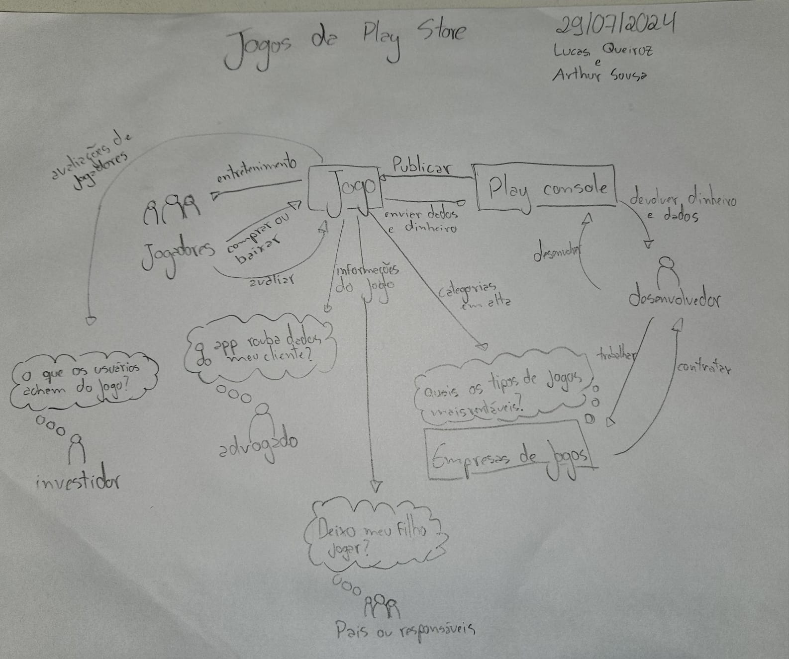
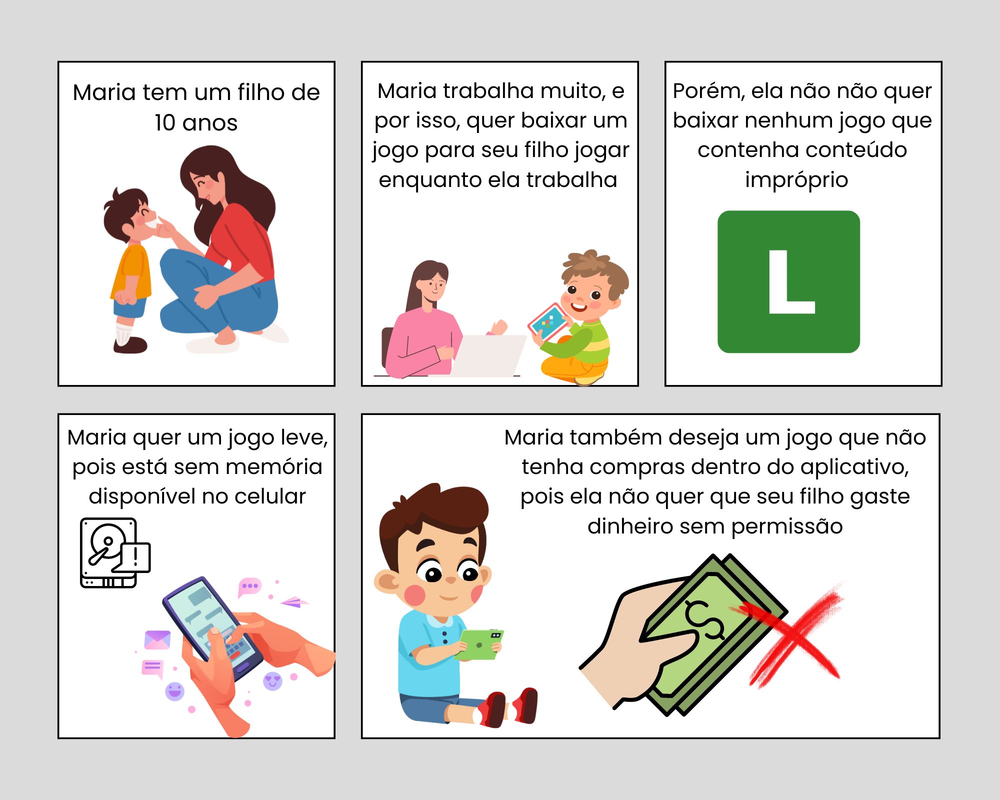

# Jogos

Esta seção é destinada para a elicitação e pré-rastreabilidade dos requisitos relacionados à área de Jogos da Play Store.
Para realizar essas tarefas, usamos as seguintes técnicas:

- Análise de protocolo: gerou, como artefato, arquivos de áudio
- Storytelling: gerou, como artefato, histórias em quadrinho e em texto
- Brainstorming: gerou, como artefato, uma Rich Picture

## Rich picture

### Versão 1.0

Método: desenho à mão

_Fonte: autores_

## Arquivos de áudio

[Clique aqui para acessar um diretório no Google Drive com os arquivos de áudio.](https://drive.google.com/drive/folders/18ZcscWDNY1OUcLuZcanFcm-xrGkef79p?usp=sharing)

## Histórias

### História 1

- João trabalha em uma empresa longe de sua casa e, por conta disso, passa muito tempo em transportes públicos. Ele decide buscar um jogo que pudesse jogar no caminho para o trabalho. Porém, ele não quer gastar dinheiro com jogos. João também não quer jogos que sejam muito complexos, pois ele quer algo para passar o tempo e se distrair. Por fim, ele quer um jogo que possa jogar offline, pois o sinal de internet no transporte público é instável.

### História 2

- Maria é uma mãe que tem um filho de 10 anos. Maria passa muito tempo trabalhando, e por isso, ela decide procurar um jogo para que seu filho possa jogar no celular. Porém, ela não quer baixar nenhum jogo que contenha conteúdos impróprios para o seu filho. Além disso, Maria não tem muito espaço disponível no celular, então ela quer um jogo que não ocupe muito espaço. Maria também deseja um jogo que não tenha compras dentro do aplicativo, pois ela não quer que seu filho gaste dinheiro sem permissão (ou acidentalmente).

## Requisitos elicitados

## Histórico de Versões

| Versão | Data       | Alterações Principais                                | Autor                        |
| ------ | ---------- | ---------------------------------------------------- | ---------------------------- |
| 1.0    | 29-07-2024 | Adição de Rich Picture para a área de jogos          | Arthur Sousa e Lucas Queiroz |
| 1.0.1  | 29-07-2024 | Adiciona mais informações sobre a área de jogos      | Arthur Sousa e Lucas Queiroz |
| 1.0.2  | 29-07-2024 | Adiciona arquivos de áudio da análise de protocolo   | Arthur Sousa e Lucas Queiroz |
| 1.0.3  | 29-07-2024 | Adiciona quadrinhos gerados a partir do Storytelling | Arthur Sousa e Lucas Queiroz |
