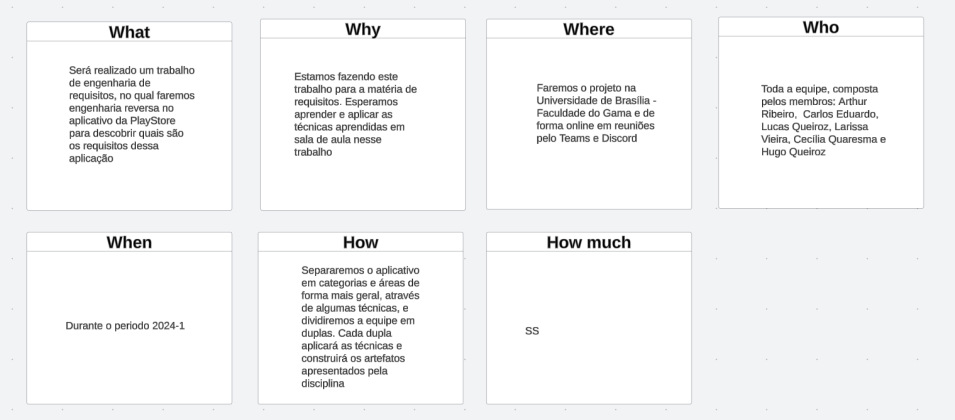
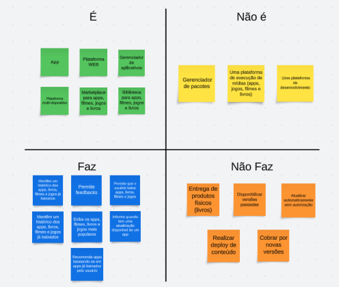
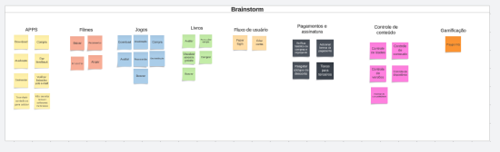

# Play Store
A Play Store é o aplicativo oficial do Google para dispositivos Android, onde você pode encontrar e baixar milhões de aplicativos, jogos, músicas, filmes, livros e revistas. Com uma interface intuitiva, a Play Store facilita a busca e a instalação de tudo o que você precisa, garantindo segurança e qualidade nos downloads. 

## Estruturação do projeto:
Para estruturar a organização do projeto, decidimos adotar uma técnica apresentada na disciplina: a [5W2H](#5w2h). Essa abordagem nos ajudará a detalhar os aspectos do projeto e definir nosso plano de ação. Com base nessa técnica, optamos por dividir o projeto em equipes menores, cada uma responsável por uma das categorias que serão definidas na seção seguinte, [Definição do Projeto](#definição-do-projeto).

### 5W2H:
O 5W2H é um método simples e de fácil aplicação para elucidar a visão dos stakeholders sobre o produto, respondendo sete questões fundamentais, que dão o nome ao método.

-O que será feito? Descrição do produto (What).

-Por que será feito? Razão de existência do produto (Why).

-Onde será feito? Local onde é feito o desenvolvimento (Where).

-Quando será feito? Datas, prazos (When).

-Quem irá fazer? Responsáveis pelo produto (Who).

-Como será feito? Metodologia, processos envolvidos (How).

-Quanto irá custar? Custo de desenvolvimento, despesas envolvidas (How much).

*Autores: Carlos Alves & Hugo Queiroz*

## Definição do projeto:
Para compreendermos o aplicativo e definirmos o escopo a ser trabalhado na matéria, começamos com um "rich picture" para entender a problemática a ser tratada. Esse artefato está disponível na pasta [Pré-Rastreabilidade:](../pre-ras/pre-ras.md#versão-01). Em seguida, construímos o artefato ["É, Não É, Faz e Não Faz"](#é-não-é-faz-e-não-faz) para definir claramente a direção do aplicativo. Utilizamos a técnica de ["brainstorming"](#brainstorming), onde cada membro da equipe sugeriu funcionalidades presentes na Play Store. Posteriormente, categorizamos essas funcionalidades, criando as áreas de atuação do projeto. Também criamos um mapa mental para visualizar o aplicativo e suas áreas como um todo. Por fim, utilizamos a técnica ["MoSCoW"](#moscow) para priorizar o escopo de atuação do grupo.

### É, Não É, Faz e Não Faz:
É uma ferramenta usada para esclarecer e definir claramente um conceito, produto, serviço, ou qualquer outro objeto de estudo. Ela ajuda a estabelecer fronteiras claras e a diferenciar o que algo realmente é e faz, do que não é e não faz.

*Autores: Toda equipe*

[Áudio da reunião - 25/07/2024](https://drive.google.com/file/d/1h--qKUerv0Oz2Zpbp3n9wXtWrgphgebi/view?usp=sharing)

### Brainstorming:
Brainstorming é uma técnica criativa usada para gerar uma grande quantidade de ideias sobre um problema ou desafio. Durante uma sessão de brainstorming, os participantes se reúnem para sugerir ideias de forma livre e espontânea, sem julgamentos imediatos. O objetivo é explorar diversas possibilidades e encontrar soluções inovadoras. As ideias são geralmente registradas e depois avaliadas para identificar as mais viáveis. Essa técnica é útil para estimular a criatividade, promover a colaboração e encontrar novas abordagens para resolver problemas.

*Autores: Toda equipe*

Ficando assim definido as categorias de:

- APP

- Jogos

- Livros

- Filmes

- Fluxo de usuário

- Pagamentos e assinaturas

- Controle

- Gamificação

[Vídeo da reunião - 25/07/2024 ](https://drive.google.com/file/d/1dOZtm7r8HbKJ7u3yDaViFvzDe5CbB4tG/view?usp=sharing) até o minuto 13:57.

### MoSCow:
MoSCoW é uma técnica de priorização usada para classificar requisitos, tarefas ou projetos com base em sua importância. O nome MoSCoW é um acrônimo que representa quatro categorias:

Must Have (Deve Ter): Requisitos essenciais que são indispensáveis para o sucesso do projeto.

Should Have (Deveria Ter): Requisitos importantes, mas não essenciais, que melhoram o projeto se incluídos.

Could Have (Poderia Ter): Requisitos desejáveis que são bons de ter, mas que podem ser adiados se necessário.

Would Have (Seria bom ter): Requisitos que são menos importantes e que podem ser deixados de lado se o tempo ou os recursos não permitirem.

    *Autores: Toda equipe*

Priorizando para primeira entrega o escopo de App, jogos, Fluxo de usuário, pagamento e assinatura e controle.

[Vídeo da reunião - 25/07/2024 ](https://drive.google.com/file/d/1dOZtm7r8HbKJ7u3yDaViFvzDe5CbB4tG/view?usp=sharing) do minuto 13:57 até o fim.

# Histórico de Versões

| Versão | Data       | Alterações Principais                             | Autor        |
|--------|------------|---------------------------------------------------|--------------|
| 1.0.0  | 25-07-2024 | Lançamento inicial da documentação.               | Carlos Alves, Hugo Queiroz     |
| 1.0.1  | 26-07-2024 |Adicionando vídeos e acrescentando informações adicionais.               | Carlos Alves|
