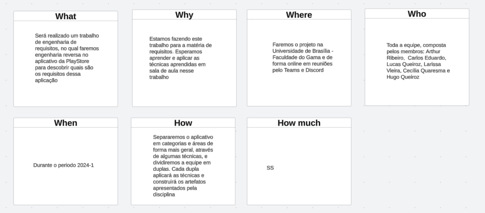
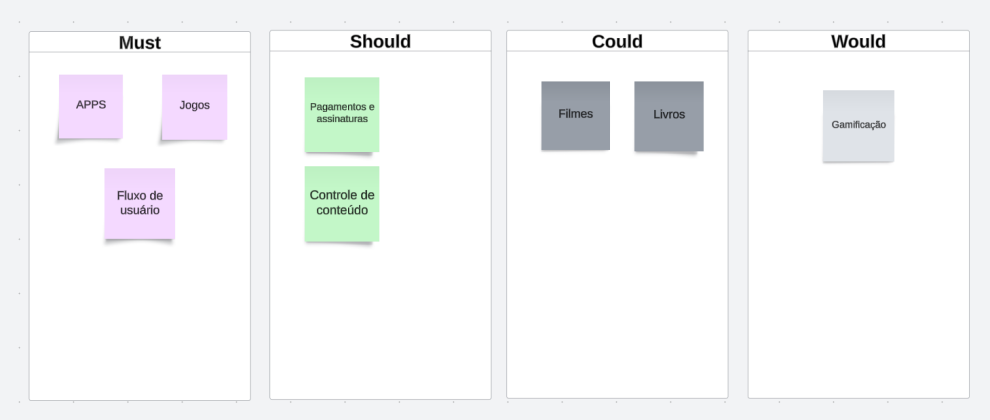

# Play Store
A Play Store é o aplicativo oficial do Google para dispositivos Android, onde você pode encontrar e baixar milhões de aplicativos, jogos, músicas, filmes, livros e revistas. Com uma interface intuitiva, a Play Store facilita a busca e a instalação de tudo o que você precisa, garantindo segurança e qualidade nos downloads. 

## Visão do produto

Para analisarmos os requisitos e as áreas que a Play Store aborda fizemos uma visão de produto este artefato tenta resumir e detalhar a Play Store.

### Problema 

A Play Store tenta resolver o problema de distribuição e compatibilidade de aplicativos, livros e filmes, para diversos dispositivos.

### Declaração de Posição do Produto

1. Qual é o produto ?
    - Play Store
2. O que torna este produto diferente dos seus concorrentes?
    - Estar vinculado a contas do Email da Google e ser o que já vem instalado na maioria dos celulares android.
3. Quem são os usuários-alvo e clientes do produto?
    - Qualquer pessoa que tenha interesse em instalar app, filmes e livros ou distribuir os mesmos.
4. Por que os clientes deveriam utilizar / comprar este produto?
    - Pelo alto número de usuários e por ser a que já vem instalada nos celulares android.

| Para | Desenvolvedores e consumidores de aplicativos e conteúdo digital |
| :-- | :-- |
| **Quem** | Usuários de Android |
| **A Play Store** |  É um marketplace |
| **Que** | Permite instalar, atualizar e remover aplicativos e jogos no celular
| **Ao contrário** | Amazon Appstore, Samsung Galaxy Store e Huawei AppGallery |
| **Nosso produto** | Apresenta uma maior segurança,  uma maior variedade e integração com a conta do Google |

### Objetivos do produto

A Google Play Store busca resolver várias problemáticas no ecossistema de aplicativos móveis, tanto para desenvolvedores quanto para 
usuários. Para desenvolvedores, oferece uma plataforma global para distribuição, diversas opções de monetização, facilidades para atualizações e suporte, 
além de verificações de segurança e conformidade. Para os usuários, proporciona acesso a aplicativos confiáveis e de alta qualidade, 
uma interface amigável para busca e gestão de apps, uma vasta gama de conteúdos para diferentes necessidades e interesses, e políticas rigorosas 
de privacidade e segurança, protegendo os dados e garantindo o controle sobre as permissões dos aplicativos. Assim, a Play Store atua 
como um intermediário essencial, promovendo um ambiente seguro e eficiente para o desenvolvimento e uso de aplicativos móveis.

## Estruturação do projeto:
Para estruturar a organização do projeto, decidimos adotar a técnica apresentada na disciplina: a [5W2H](#5w2h). Essa abordagem nos ajudará a detalhar os aspectos do projeto e definir nosso plano de ação. Com base nessa técnica, optamos por dividir o projeto em equipes menores, cada uma responsável por uma das categorias definidas na seção seguinte, [Definição do Projeto](#definição-do-projeto). Após a conclusão das tarefas realizadas por essas equipes menores, nos reuniremos como equipe completa para debater e analisar o trabalho realizado.

### 5W2H:
O 5W2H é um método simples e de fácil aplicação para elucidar a visão dos stakeholders sobre o produto, respondendo sete questões fundamentais, que dão o nome ao método.

-O que será feito? Descrição do produto (What).

-Por que será feito? Razão de existência do produto (Why).

-Onde será feito? Local onde é feito o desenvolvimento (Where).

-Quando será feito? Datas, prazos (When).

-Quem irá fazer? Responsáveis pelo produto (Who).

-Como será feito? Metodologia, processos envolvidos (How).

-Quanto irá custar? Custo de desenvolvimento, despesas envolvidas (How much).

*Autores: Carlos Alves & Hugo Queiroz*

## Definição do projeto:
Para compreendermos o aplicativo e definirmos o escopo a ser trabalhado na matéria, começamos com um "rich picture" para entender a problemática a ser tratada. Esse artefato está disponível na pasta [Pré-Rastreabilidade:](../pre-ras/pre-ras.md#versão-01). Em seguida, construímos o artefato ["É, Não É, Faz e Não Faz"](#é-não-é-faz-e-não-faz) para definir claramente a direção do aplicativo. Utilizamos a técnica de ["brainstorming"](#brainstorming), onde cada membro da equipe sugeriu funcionalidades presentes na Play Store. Posteriormente, categorizamos essas funcionalidades, criando as áreas de atuação do projeto. Também criamos um mapa mental para visualizar o aplicativo e suas áreas como um todo. Esse artefato está disponível na pasta [Pré-Rastreabilidade:](../pre-ras/pre-ras.md). Por fim, utilizamos a técnica ["MoSCoW"](#moscow) para priorizar o escopo de atuação do grupo.

### É, Não É, Faz e Não Faz:
É uma ferramenta usada para esclarecer e definir claramente um conceito, produto, serviço, ou qualquer outro objeto de estudo. Ela ajuda a estabelecer fronteiras claras e a diferenciar o que algo realmente é e faz, do que não é e não faz.

*Autores: Toda equipe*

[Áudio da reunião - 25/07/2024](https://drive.google.com/file/d/1h--qKUerv0Oz2Zpbp3n9wXtWrgphgebi/view?usp=sharing)

### Brainstorming:
Brainstorming é uma técnica criativa usada para gerar uma grande quantidade de ideias sobre um problema ou desafio. Durante uma sessão de brainstorming, os participantes se reúnem para sugerir ideias de forma livre e espontânea, sem julgamentos imediatos. O objetivo é explorar diversas possibilidades e encontrar soluções inovadoras. As ideias são geralmente registradas e depois avaliadas para identificar as mais viáveis. Essa técnica é útil para estimular a criatividade, promover a colaboração e encontrar novas abordagens para resolver problemas.

*Autores: Toda equipe*

Ficando assim definido as categorias de:

- APP

- Jogos

- Livros

- Filmes

- Fluxo de usuário

- Pagamentos e assinaturas

- Controle

- Gamificação

[Vídeo da reunião - 25/07/2024 ](https://drive.google.com/file/d/1dOZtm7r8HbKJ7u3yDaViFvzDe5CbB4tG/view?usp=sharing) até o minuto 13:57.

### MoSCow:
MoSCoW é uma técnica de priorização usada para classificar requisitos, tarefas ou projetos com base em sua importância. O nome MoSCoW é um acrônimo que representa quatro categorias:

Must Have (Deve Ter): Requisitos essenciais que são indispensáveis para o sucesso do projeto.

Should Have (Deveria Ter): Requisitos importantes, mas não essenciais, que melhoram o projeto se incluídos.

Could Have (Poderia Ter): Requisitos desejáveis que são bons de ter, mas que podem ser adiados se necessário.

Would Have (Seria bom ter): Requisitos que são menos importantes e que podem ser deixados de lado se o tempo ou os recursos não permitirem.

*Autores: Toda equipe*

E devido ao escopo da Play Store ser grande para apenas um semestre, optamos por:

Priorizar, para a primeira entrega, o escopo do 'Must Have', que se resume em app, jogos e fluxo de usuário. Como mencionado anteriormente, separamos a equipe em duplas, onde cada uma ficou responsável por uma das categorias. A divisão ficou assim:

- APP - Cecília Quaresma e Hugo Queiroz

- Jogos - Arthur Ribeiro e Lucas Queiroz

- Fluxo de Usuário - Carlos Alves e Larissa Vieira

[Vídeo da reunião - 25/07/2024 ](https://drive.google.com/file/d/1dOZtm7r8HbKJ7u3yDaViFvzDe5CbB4tG/view?usp=sharing) do minuto 13:57 até o fim.

## Histórico de Versões

| Versão | Data       | Alterações Principais                             | Autor        |
|--------|------------|---------------------------------------------------|--------------|
| 1.0.0  | 25-07-2024 | Lançamento inicial da documentação.               | Carlos Alves, Hugo Queiroz     |
| 1.0.1  | 26-07-2024 | Adicionando vídeos e acrescentando informações adicionais.               | Carlos Alves|
| 1.0.2  | 31-07-2014 | Adicionando visão do produto e projeto | Lucas Queiroz, Arthur Sousa, Cecília Quaresma, Hugo Queiroz, Carlos Alves e Larissa Vieira |
| 1.0.3  | 09-08-2014 | Melhorando descrição do projeto | Hugo Queiroz, Carlos Alves |
