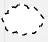
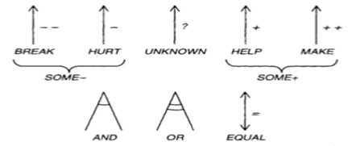

# GORE

Esta secção é destinada as técnicas de modelagem GORE que é orientação a meta, e a explicação das técnicas utilizadas.

Sendo cada pasta destinada a uma das técnicas utilizadas, e os artefato gerados para cada uma das categorias definidas na [Home](../../home/home.md) e seus [requistos elicitados](../../elicitacao/elicitacao.md).

## Explicação de GORE

GORE (ou "Goal-Oriented Requirements Engineering") é um modelo de engenharia de requisitos focado em "Orientação a Metas". É uma abordagem usada para capturar, analisar e gerenciar requisitos de sistemas com base nas metas e objetivos dos stakeholders. A ideia central é que os requisitos devem estar alinhados com as metas e objetivos que o sistema ou projeto pretende atingir, garantindo que o produto final atenda às necessidades e expectativas dos stakeholders.

## Técnicas

### NFR Framework

A técnica NFR Framework (Non-Functional Requirements Framework) é uma abordagem estruturada para a elicitação, modelagem, análise e documentação de requisitos não-funcionais (NFRs) em um projeto de software. Requisitos não-funcionais são aqueles que definem os atributos de qualidade do sistema, como desempenho, segurança, usabilidade, confiabilidade, entre outros. Esses requisitos complementam os requisitos funcionais, que especificam o que o sistema deve fazer.

Neste framework utiliza-se o Softgoal Interdependency Graph (SIG):

Que é um gráfico que é utilizado para representar as metas flexíveis que se deseja alcançar e os recursos necessários para atingi-las. Para isso, ele adota a seguinte notação:

| Nome              | Descrição                                                                                                           | Ícone                                                            |
|-------------------|---------------------------------------------------------------------------------------------------------------------|------------------------------------------------------------------|
| **Softgoal**        | Característica abstrata, a qual se deseja considerar na análise, visando saber se a mesma será cumprida ou não cumprida, ou seja, escolhida ou não escolhida para ser implementada.                                     |   |
| **Operationalization** | Forma concreta de viabilizar ou não as características abstratas. Aqui, no fundo, são funcionalidades! |              |
| **Argumentation**  | Anotações que podem ser acrescentadas ao modelo, argumentando algo sobre um ponto específico da modelagem. Escrita em linguagem natural.                        |                     |
| **Contributions**      | Usadas para representar as relações ou interações entre nuvens                                   |                          |

## Histórico de Versões

| **Versão** | **Data** | **Alterações Principais** | **Autor** |
| :--: | :--: | :--: | :--: | 
| 1.0.0 | 21-08-2024 | Lançamento inicial  | Carlos Alves |