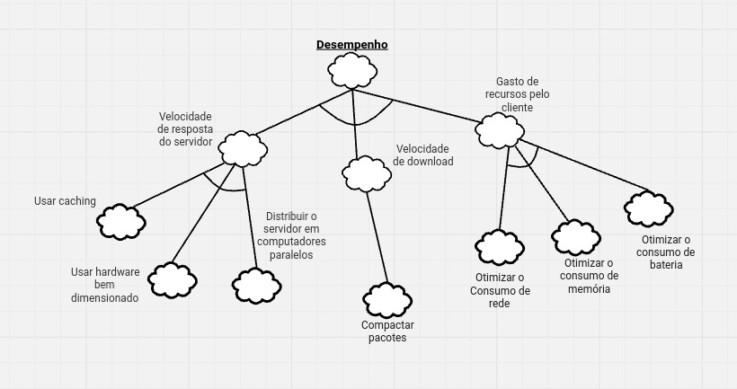

# NFR Framework

A técnica NFR Framework esta definida em [NFR](gore.md#nfr-framework) e a notação dos gráficos abaixo.

Utilizamos os requisitos não funcionais elicitados através de brainstorm para inspirar a criação dos NFR Frameworks e utilizamos as categorias do brainstorm como as principais Softgoals dos NFR a seguir. A elicitação está disponível em: [não funcionais](../elicitacao/nao_funcionais.md)

## Resultado da técnica

### Usabilidade
<!--iFrame de Usabilidade-->

#### Versão 1.0

*Autores: Toda equipe*

#### Versão 1.1

<iframe width="768" height="432" src="https://miro.com/app/live-embed/uXjVKnuPv_U=/?moveToViewport=-1380,-539,4654,2341&embedId=227573380221" frameborder="0" scrolling="no" allow="fullscreen; clipboard-read; clipboard-write" allowfullscreen></iframe>

*Autores: Toda equipe*

### Desempenho
<!--iFrame de Desempenho-->

#### Versão 1.0

*Autores: Toda equipe*

#### Versão 1.1

<iframe width="768" height="432" src="https://miro.com/app/live-embed/uXjVKnulZUk=/?moveToViewport=-2700,-847,4654,2341&embedId=795896470252" frameborder="0" scrolling="no" allow="fullscreen; clipboard-read; clipboard-write" allowfullscreen></iframe>

*Autores: Toda equipe*

### Confiabilidade
<!--iFrame de Confiabilidade-->

#### Versão 1.0

*Autores: Toda equipe*

#### Versão 1.1

<iframe width="768" height="432" src="https://miro.com/app/live-embed/uXjVKnv71KM=/?moveToViewport=-3911,-572,4654,2341&embedId=579818778436" frameborder="0" scrolling="no" allow="fullscreen; clipboard-read; clipboard-write" allowfullscreen></iframe>

*Autores: Toda equipe*

### Segurança
<!--iFrame de Segurança-->

#### Versão 1.0

*Autores: Toda equipe*

#### Versão 1.1

<iframe width="768" height="432" src="https://miro.com/app/live-embed/uXjVKoNUl54=/?moveToViewport=-5053,-958,4654,2341&embedId=282149109656" frameborder="0" scrolling="no" allow="fullscreen; clipboard-read; clipboard-write" allowfullscreen></iframe>

*Autores: Toda equipe*

### Portabilidade

#### Versão 1.0

*Autores: Toda equipe*

#### Versão 1.1

<iframe width="768" height="432" src="https://miro.com/app/live-embed/uXjVKnuJcj4=/?moveToViewport=-3084,-573,2178,1095&embedId=248809276064" frameborder="0" scrolling="no" allow="fullscreen; clipboard-read; clipboard-write" allowfullscreen></iframe>

*Autores: Toda equipe*

### Análise geral

#### Versão 1.0

<iframe width="768" height="432" src="https://miro.com/app/live-embed/uXjVKhgSTqA=/?moveToViewport=-10953,-4743,26561,9670&embedId=159460149680" frameborder="0" scrolling="no" allow="fullscreen; clipboard-read; clipboard-write" allowfullscreen></iframe>

*Autores: Toda equipe*

## Histórico de Versões

| **Versão** | **Data** | **Alterações Principais** | **Autor** |
| :--: | :--: | :--: | :--: | 
| 1.0.0 | 20-08-2024 | Criação do documento de inclusão dos iFrames | Arthur Sousa, Carlos Alves, Cecília Quaresma, Larissa Vieira, Lucas Queiroz e Hugo Queiroz |
| 1.0.1 | 21-08-2024 | Ajustando textos  | Carlos Alves |
| 1.0.2 | 05-09-2024 | Atualizando documento  | Larissa Vieira, Hugo Queiroz |
| 1.0.3 | 06-09-2024 | Adição de análise geral | Arthur Ribeiro |
