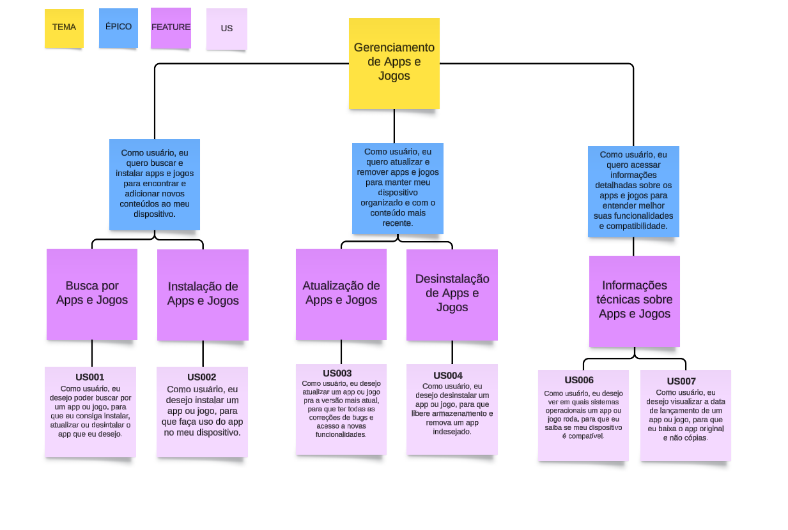
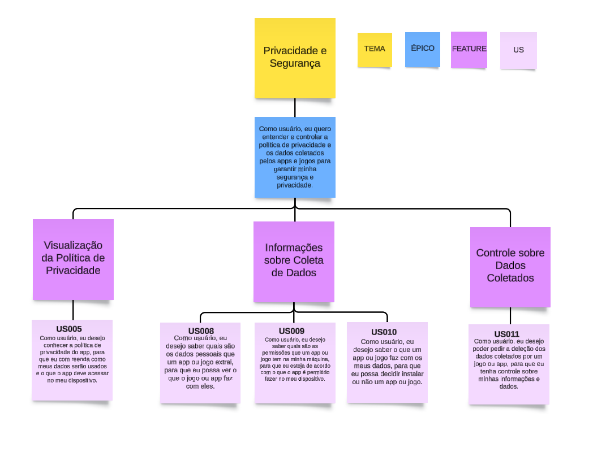
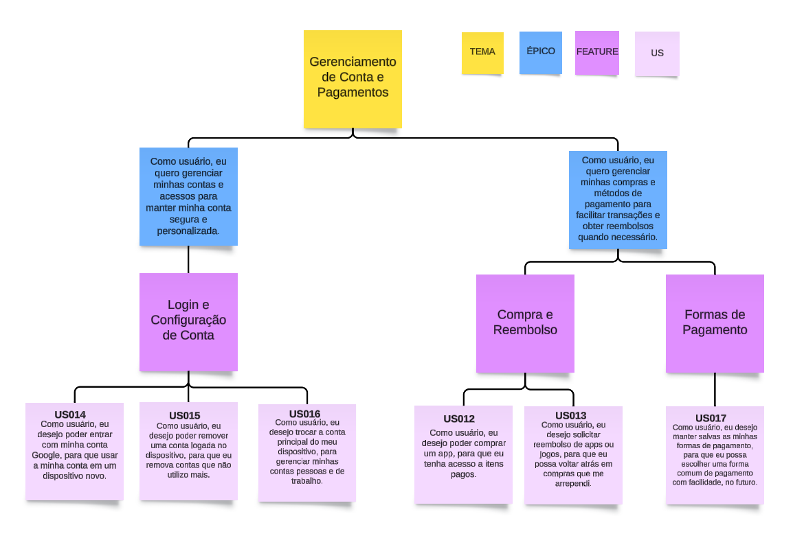

# [Backlog](agil.md#backlog)

A explicação da técnica esta definida em [Backlog](agil.md#backlog).

## [Product Backlog](agil.md#product-backlog)

A explicação da técnica esta definida em [product backlog](agil.md#product-backlog).

Para esta parte, definimos uma lista de funcionalidades baseadas nos [requisitos elicitados](../../elicitacao/elicitacao.md) e priorizadas de acordo com sua importância. As funcionalidades foram descritas em histórias de usuário, detalhadas na seção [Histórias de Usuário](criterio.md).

| História | Requisito | Como | Desejo | Para que | Prioridade |
| --- | --- | --- | --- | --- | --- |
|  US001 | [REQ01](../../elicitacao/elicitacao.md#REQ01) | Usuário | Poder buscar por um app ou jogo | Eu consiga instalar, atualizar ou desintalar o app que eu desejo | Must |
|  US002 | [REQ02](../../elicitacao/elicitacao.md#REQ02) | Usuário | Instalar um app ou jogo | Faça uso do app no meu dispositivo | Must |
|  US003 | [REQ03](../../elicitacao/elicitacao.md#REQ03) | Usuário | Desejo atualizar um app ou jogo pra a versão mais atual | Para ter todas as correções de bugs e acesso a novas funcionalidades | Must |
|  US004 | [REQ04](../../elicitacao/elicitacao.md#REQ04) | Usuário | Desinstalar um app ou jogo | Libere armazenamento e remova um app indesejado | Must |
|  US005 | [REQ05](../../elicitacao/elicitacao.md#REQ05) | Usuário | Conhecer a política de privacidade do app | eu com reenda como meus dados serão usados e o que o app deve acessar no meu dispositivo| Must |
|  US006 | [REQ06](../../elicitacao/elicitacao.md#REQ06) | Usuário | Ver em quais sistemas operacionais um app ou jogo roda | Eu saiba se meu dispositivo é compatível | Must |
|  US007 | [REQ07](../../elicitacao/elicitacao.md#REQ07) | Usuário | Visualizar a data de lançamento de um app ou jogo |Eu baixa o app original e não cópias  | Must |
|  US008 | [REQ08](../../elicitacao/elicitacao.md#REQ08) | Usuário | Saber quais são os dados que um app ou jogo extrai dos usuários |Possa proteger meus dados| Must |
|  US009 | [REQ09](../../elicitacao/elicitacao.md#REQ09) | Usuário | Saber quais são as permissões que um app ou jogo tem na minha máquina | Eu esteja de acordo com o que o app é permitido fazer no meu dispositivo | Must |
|  US010 | [REQ10](../../elicitacao/elicitacao.md#REQ10) | Usuário | Saber o que um app ou jogo faz com os meus dados | Eu possa decidir instalar ou não um app ou jogo | Must |
|  US011 | [REQ11](../../elicitacao/elicitacao.md#REQ11) | Usuário | Poder pedir a deleção dos dados coletados por um jogo ou app | Ter controle sobre minhas informações e dados | Must |
|  US012 | [REQ12](../../elicitacao/elicitacao.md#REQ12) | Usuário | Comprar um app ou jogo | Eu tenha acesso a itens pagos | Must |
|  US013 | [REQ13](../../elicitacao/elicitacao.md#REQ13) | Usuário | Pedir reembolso por um app ou jogo | Eu resgate o dinheiro de um app ou jogo que eu não gostei | Must |
|  US014 | [REQ14](../../elicitacao/elicitacao.md#REQ14) | Usuário | Entrar com a minha conta Google | Eu use a minha conta em um celular novo | Must |
|  US015 | [REQ16](../../elicitacao/elicitacao.md#REQ16) | Usuário | Poder remover uma conta logada no dispositivo | Eu possa retirar contas que não utilizo mais | Must |
|  US016 | [REQ17](../../elicitacao/elicitacao.md#REQ17) | Usuário | Trocar a conta principal do meu dispositivo | Poder gerenciar minhas contas pessoas e de trabalho | Must |
|  US017 | [REQ18](../../elicitacao/elicitacao.md#REQ18) | Usuário | Poder manter salva minhas formas de pagamento | Economize tempo em futuras compras | Must |

## Granularização de Histórias de Usuário

| Tema | Épico | Feature                                  | User Story                                                                                                                                  |
|--------------------------------|------------------------------------------------|------------------------------------------|----------------------------------------------------------------------------------------------------------------------------------------------|
| **Gerenciamento de Apps e Jogos** | Como usuário, eu quero buscar e instalar apps e jogos para encontrar e adicionar novos conteúdos no meu dispositivo. | Busca por Apps e Jogos                   | **US001** |
|                                |                                                | Instalação de Apps e Jogos               | **US002**                                  |
|                                | Como usuário, eu quero atualizar e remover apps e jogos para manter meu dispositivo organizado e com o conteúdo mais recente. | Atualização de Apps e Jogos              | **US003**|
|                                |                                                | Desinstalação de Apps e Jogos            | **US004**                      |
|                                | Como usuário, eu quero acessar informações detalhadas sobre os apps e jogos para entender melhor suas funcionalidades e compatibilidade. | Informações técnicas sobre Apps e Jogos  | **US006**      |
|                                |                                                |                                          | **US007**      |
| **Privacidade e Segurança**      | Como usuário, eu quero entender e controlar a política de privacidade e os dados coletados pelos apps e jogos para garantir minha segurança e privacidade. | Visualização da Política de Privacidade  | **US005** |
|                                |                                                | Informações sobre Coleta de Dados        | **US008**|
|                                |                                                |                                          | **US009** |
|                                |                                                |                                          | **US010**|
|                                |                                                | Controle sobre Dados Coletados           | **US011** |
| **Gerenciamento de Conta e Pagamentos** | Como usuário, eu quero gerenciar minhas contas e acessos para manter minha conta segura e personalizada. | Login e Configuração de Conta            | **US014**               |
|                                |                                                |                                          | **US015**          |
|                                |                                                |                                          | **US016**         |
|                                | Como usuário, eu quero gerenciar minhas compras e métodos de pagamento para facilitar transações e obter reembolsos quando necessário. | Compra e Reembolso                       | **US012**                                              |
|                                |                                                |                                          | **US013**|                                                
|   |   | Formas de Pagamento                      | **US017**|

*Autores: Larissa Vieira*

## [Sprint Backlog](agil.md#sprint-backlog)

Para esta parte utilizamos o método [Planning Poker](agil.md#planning-poker) com pontuação Fibonacci para priorizar as [histórias de usuário](criterio.md) que modelamos. Decidimos que nossa Sprint teria duas semanas e nossa equipe poderia entregar até 13 pontos. Também decidimos o backlog de cada Sprint us ndo como critérios acapacidade da equipe e prioridade para entrega dos itens. Segue abaixo o Sprint Backlog das 6 sprints que julgamos necessárias:

| História  |                   Nome                                                |  Sprint  | Pontos |
| --------- | --------------------------------------------------------------------- | -------- | ------ |
| [US001](criterio.md#us001---buscar-app-ou-jogo) | Buscar app ou jogo              |    01    |   3    |
| [US002](criterio.md#us002---instalar-app-ou-jogo) | Instalar app ou jogo          |    01    |   5    |
| [US014](criterio.md#us014---entrar-com-minha-conta-google) | Entrar com minha conta Google |    01    |   3    |
| [US003](criterio.md#us003---atualizar-app-ou-jogo)         | Atualizar app ou jogo                                                 |    02    |   3    |
| [US004](criterio.md#us004---desistalar-app-ou-jogo)        | Desinstalar app ou jogo                                               |    02    |   3    |
| [US012](criterio.md#us012---comprar-app-ou-jogo)           | Comprar app ou jogo                                                   |    03    |   8    |
| [US013](criterio.md#us013---pedir-reembolso)               | Pedir reembolso                                                       |    03    |   5    |
| [US006](criterio.md#us006---sistema-operacional-compatível)            | Sistema operacional compatível                                        |    04    |   1    |
| [US007](criterio.md#us007---visualizar-data-de-lançamento) | Visualizar data de lançamento                                         |    04    |   1    |      
| [US016](criterio.md#us016---trocar-a-conta-principal)      | Trocar a conta principal                                              |    04    |   2    |
| [US017](criterio.md#us017---manter-forma-de-pagamentos-salva) | Manter forma de pagamentos salva                                      |    04    |   5    |
| [US005](criterio.md#us005---política-de-privacidade)       | Política de privacidade                                               |    05    |   2    |
| [US008](criterio.md#us008---dados-extraídos-dos-usuários) | Saber quais são os dados que um app ou jogo extrai dos usuários       |    05    |   5    |
| [US009](criterio.md#us009---permissões-de-app-ou-jogo)    | Saber quais são as permissões que um app ou jogo tem na minha máquina |    05    |   3    |
| [US011](criterio.md#us011---pedir-deleção-dos-dados)         | Pedir deleção dos dados coletados                                     |    06    |   2    |
| [US010](criterio.md#us010---objetivo-dos-dados-extraídos) | Saber o que o jogo faz com os dados coletados                         |    06    |   3    |
| [US015](criterio.md#us015---remover-uma-conta-logada)     | Poder remover uma conta logada no dispositivo                         |    06    |   3    |

## Planejamento de Releases

Decidimos as releases hipotéticas com base nos temas que seriam entregues nas sprints. 

| Release |   Sprints   |                             Descrição                                 | Total de pontos entregues |
| ------- | ----------- | --------------------------------------------------------------------- | ------------------------- |
|    01   | 01 e 02     | **MVP**: Busca, download, atualização e desinstalação de apps e jogos | 17 |
|    02   | 03          | **MVP**: Pagamento de apps e jogos | 13 |
|    03   | 04, 05 e 06 | **MVP**: Políticas de privacidade e segurança | 27 |

## Histórico de Versões

| **Versão** | **Data** | **Alterações Principais** | **Autor** |
| :--: | :--: | :--: | :--: | 
| 1.0.0 | 19-08-2024 | Lançamento inicial do Backlog | Arthur Sousa, Carlos Alves, Cecília Quaresma, Hugo Queiroz e Larissa Vieira |
| 1.0.1 | 20-08-2024 | Melhorando documento textual backlog | Carlos Alves |
| 1.0.2 | 21-08-2024 | Implementação do sprint backlog | Arthur Sousa, Carlos Alves, Cecília Quaresma, Hugo Queiroz, Lucas Queiroz e Larissa Vieira |
| 1.0.3 | 22-08-2024 | Adição de Planejamento de Releases | Arthur Sousa e Lucas Queiroz |
| 1.0.4 | 22-08-2024 | Adição de Granularização de Histórias de Usuário | Cecília Quaresma e Larissa Vieira |
