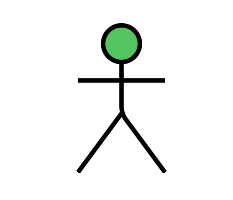
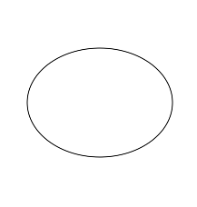
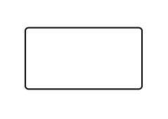

# Caso de uso

Um caso de uso consiste em uma descrição detalhada relativa à maneira como os usuários interagem com o sistema para alcançar um determinado objetivo. Ao mapear as intruções entre os atores e o sistema, o artefato faz uma descrição clara das etapas necessárias que precisam ser seguidas para alcançar o objetivo.

## Diagrama de caso de uso

Um diagrama de caso de uso é uma representação visual que descreve como um sistema interage com usuários ou outros sistemas (atores) para realizar tarefas específicas (casos de uso). Ele mostra as funcionalidades do sistema e as interações entre os atores e essas funcionalidades, ajudando a identificar e entender os requisitos do sistema de maneira clara e concisa.

### Tabela 1: Componentes do Diagrama de Casos de Uso

| Nome              | Descrição                                                                                                           | Ícone                                                            |
|-------------------|---------------------------------------------------------------------------------------------------------------------|------------------------------------------------------------------|
| **Agente**        | Representa os diferentes tipos de usuários externos que interagem com o sistema                                     |                            |
| **Elipse (Caso de Uso)** | Utilizada para representar os casos de uso no diagrama. Um caso de uso descreve uma funcionalidade ou ação específica que o sistema pode executar em resposta às interações dos agentes. A elipse contém o nome do caso de uso |                          |
| **Retângulo (Sistema)**  | Representa o sistema ou o bloco em análise. Envolve os casos de uso e agentes relacionados                        |                      |
| **Setas (Relações)**      | Usadas para representar as relações ou interações entre agentes e casos de uso                                    |                             |

## Versão 01
Este é uma primeira versão de uma visão mais geral da play store e dentro dela outros dois sistemas que achamos relevantes ter, baseados nos [requisitos elicitados](../elicitacao/elicitacao.md)

*Autores: Carlos Alves, Cecília Quaresma, Hugo Queiroz & Larissa Vieira*

## Especificação de caso de uso

A especificação de caso de uso é um documento que detalha como um caso de uso deve funcionar, descrevendo interações entre o ator e o sistema. Ela inclui informações como o nome do caso de uso, a descrição do que ele faz, condições prévias e posteriores, fluxos principais e alternativos, e requisitos especiais. Essa documentação ajuda a entender e a implementar corretamente os requisitos do sistema.

Nesta etapa pegamos as elipse do diagrama de caso de uso e as especificamos para melhor entedimento da play store.

Explicando a tabela:

|  |  |
|--------------------|-----------------------------------------------|
| **Descrição**      | Um breve resumo do que é o caso de uso |
| **Ator(es)**       | Quem está praticando o caso de uso                        |
| **Pré-Requisitos** | O que é necessário para que ele ocorra |
| **Fluxo Principal** | Sequência de passos normal do caso de uso e os fluxos alternativaos e de execção a frente do passo que eles podem ocorrer |
| **Fluxo Alternativo** | É um caminho diferente que o usuário pode seguir para completar a mesma tarefa, geralmente devido a uma escolha ou condição específica. |
| **Fluxo de Exceção** | É o caminho que o sistema segue quando ocorre um erro ou uma condição inesperada, exigindo uma ação corretiva. |

---

### Visualizar app/jogo

|  |  |
|--------------------|-----------------------------------------------|
| **Descrição**      | O usuário deseja buscar/visualizar apps/jogos |
| **Ator(es)**       | Usuário e a Play Store                        |
| **Pré-Requisitos** | Possuir a Play Store instalada e ter conexão à internet |
| **Fluxo Principal** | 1. Usuário abre a Play Store.   2. A Play Store exibe a tela inicial.   3. Usuário usa a barra de pesquisa para procurar o app/jogo. [FA01](#fa01) [FA02](#fa02) [FE01](#fe01)   4. Usuário clica no ícone do app/jogo. |
| **Fluxo Alternativo** | **FA01: O usuário usa as categorias**   1. Após abrir a tela inicial, o usuário navega pelas categorias disponíveis.   2. Usuário clica na categoria desejada. [FA01.1](#fa011)   3. A Play Store mostra os apps/jogos daquela categoria.   4. O usuário segue o fluxo principal.    **FA01.1: O usuário usa a aba categorias**   1. Após abrir a tela inicial, o usuário busca a aba "Categorias".   2. Usuário escolhe a categoria desejada.   3. Usuário navega buscando o app/jogo.   4. Usuário segue o fluxo principal.    **FA02: O usuário acha na tela inicial**   1. Após abrir a tela inicial, o usuário encontra o app/jogo na tela inicial.   2. Usuário segue o fluxo principal. |
| **Fluxo de Exceção** | **FE01: O app/jogo não está disponível na Play Store**   1. Após o usuário buscar o app/jogo, o item desejado não aparece na Play Store.   2. O usuário verifica os motivos de não encontrar o app/jogo.   3. O usuário reinicia o fluxo principal se identificar o erro. |

---

### Instalar aplicativos

|  |  |
|--------------------|-----------------------------------------------|
| **Descrição**      | O usuário deseja instalar em seu dispositivo apps/jogos |
| **Ator(es)**       | Usuário e a Play Store                                  |
| **Pré-Requisitos** | Possuir a Play Store, ter rede, espaço suficiente e bateria |
| **Fluxo Principal** | 1. Usuário segue o [fluxo de visualizar app](#visualizar-appjogo).   2. O usuário clica no botão de "instalar". [FE02](#fe02) [FE03](#fe03) [FE04](#fe04)   3. Usuário aguarda a instalação do app/jogo no seu dispositivo. |
| **Fluxo de Exceção** | **FE02: Falha na rede**   1. A Play Store para a instalação.   2. A Play Store fica aguardando a conexão voltar.    **FE03: O dispositivo acaba a bateria durante a instalação**   1. Após iniciar a instalação, o dispositivo acaba a bateria.   2. O usuário coloca o dispositivo para carregar.   3. O usuário reinicia o fluxo principal.    **FE04: O dispositivo não está com espaço suficiente**   1. Após iniciar a instalação, a Play Store informa que não há espaço disponível.   2. O usuário soluciona o problema para continuar e retoma o fluxo principal. |

---

### Atualizar Aplicativos

|  |  |
|--------------------|-----------------------------------------------|
| **Descrição**      | O usuário deseja atualizar apps/jogos em seu dispositivo |
| **Ator(es)**       | Usuário e a Play Store                                    |
| **Pré-Requisitos** | Possuir a Play Store, ter rede, espaço suficiente e bateria |
| **Fluxo Principal** | 1. O usuário segue o [fluxo de visualizar app](#visualizar-appjogo). [FA03](#fa03)   2. O usuário clica no botão de "Atualizar". [FE05](#fe05) [FE06](#fe06) [FE07](#fe07)   3. O usuário aguarda a atualização do app/jogo no seu dispositivo. |
| **Fluxo Alternativo** | **FA03: O usuário usa a página de gerenciar apps e dispositivos**   1. Após abrir a tela inicial, o usuário clica na sua conta.   2. O usuário clica em "gerenciar apps e dispositivos".   3. O usuário clica em "Gerenciar".   4. O usuário escolhe a opção "Atualizações disponíveis".   5. O usuário escolhe os apps/jogos que deseja atualizar.   6. O usuário clica no botão de atualizar. |
| **Fluxo de Exceção** | **FE05: Falha na rede**   1. A Play Store para a atualização.   2. A Play Store fica aguardando a conexão voltar.    **FE06: O dispositivo acaba a bateria durante a atualização**   1. Após iniciar a atualização, o dispositivo acaba a bateria.   2. O usuário coloca o dispositivo para carregar.   3. O usuário reinicia o fluxo principal.    **FE07: O dispositivo não está com espaço suficiente**   1. Após iniciar a atualização, a Play Store informa que não há espaço disponível.   2. O usuário soluciona o problema para continuar e retoma o fluxo principal. |

---

### Desinstalar aplicativos

|  |  |
|--------------------|-----------------------------------------------|
| **Descrição**      | O usuário deseja desinstalar em seu dispositivo apps/jogos |
| **Ator(es)**       | Usuário e a Play Store                                     |
| **Pré-Requisitos** | Possuir a Play Store e ter bateria                         |
| **Fluxo Principal** | 1. Usuário segue o [fluxo de visualizar app](#visualizar-appjogo). [FA04](#fa04)   2. O usuário clica no botão de "Desinstalar". [FE08](#fe08)   3. Usuário aguarda a desinstalação do app/jogo no seu dispositivo. |
| **Fluxo Alternativo** | **FA04: O usuário usa a página de gerenciar apps e dispositivos**   1. Após abrir a tela inicial, o usuário clica na sua conta.   2. O usuário clica em "gerenciar apps e dispositivos".   3. O usuário clica em "Gerenciar".   4. O usuário escolhe os apps/jogos que deseja desinstalar.   5. O usuário clica no botão da lixeira para desinstalar. |
| **Fluxo de Exceção** | **FE08: O dispositivo acaba a bateria durante a desinstalação**   1. Após iniciar a desinstalação, o dispositivo acaba a bateria.   2. O usuário coloca o dispositivo para carregar.   3. O usuário reinicia o fluxo principal. |

---

### Avaliar aplicativos

|  |  |
|--------------------|-----------------------------------------------|
| **Descrição**      | O usuário deseja avaliar apps/jogos                       |
| **Ator(es)**       | Usuário e a Play Store                                     |
| **Pré-Requisitos** | Possuir a Play Store, ter rede e ter bateria               |
| **Fluxo Principal** | 1. Usuário segue o [fluxo de visualizar app](#visualizar-appjogo). [FE05](#fe05)   2. O usuário clica na quantidade de estrelas. [FE08](#fe08)   3. O usuário preenche os campos permitidos.   4. O usuário clica em "Postar". |
| **Fluxo Alternativo** | **FA05: O usuário já está na página do app/jogo**   1. O usuário segue o fluxo principal. |
| **Fluxo de Exceção** | **FE09: Falha na rede**   1. Após iniciar a avaliação, o dispositivo desconecta da rede.   2. A Play Store fica aguardando a conexão voltar.    **FE10: O dispositivo acaba a bateria durante a avaliação**   1. Após iniciar a avaliação, o dispositivo acaba a bateria.   2. O usuário coloca o dispositivo para carregar.   3. O usuário reinicia o fluxo principal. |

---

## Histórico de Versões
 
| **Versão** | **Data** | **Alterações Principais** | **Autor** |
| :--: | :--: | :--: | :--: | 
| 1.0.0 | 14-08-2024 | Criação do documento | Carlos Alves, Cecília Quaresma, Hugo Queiroz e Larissa Vieira|
| 1.0.1 | 14-08-2024 | Adicionando diagrama | Carlos Alves, Cecília Quaresma, Hugo Queiroz e Larissa Vieira|
| 1.0.2 | 15-08-2024 | Adicionando especificação de caso de uso | Carlos Alves e Hugo Queiroz|
| 1.0.3 | 15-08-2024 | Arrumando  documento de caso de uso | Carlos Alves, Hugo Queiroz e Arthur Ribeiro|