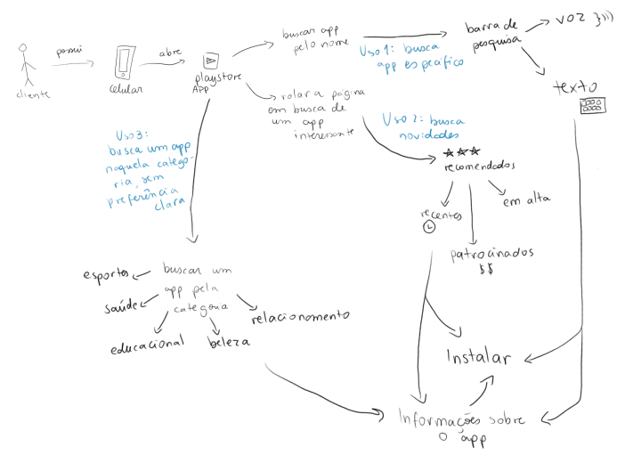
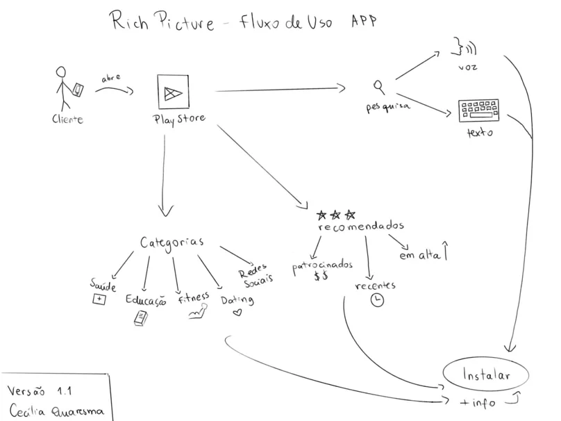
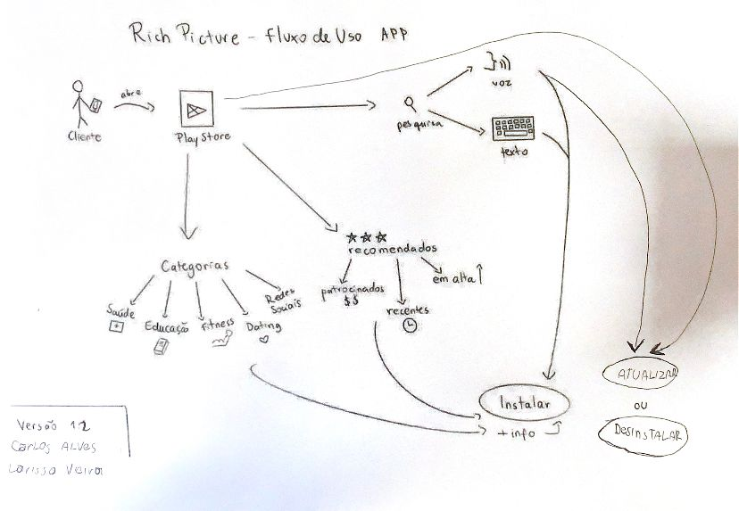

# APPS

Esta seção é destinada para a pré-rastreabilidade dos requisitos relacionados à área de Apps da Play Store, esta categoria foi definida na secção [Home](../home/home.md).

## [Rich picture](pre-ras.md#rich-picture)

O artefato está definido em [rich picture](../pre-ras/pre-ras.md).

### Versão 1.0

*Autores: Cecília Queresma & Hugo Queiroz*

### Versão 1.1

*Autor: Cecília Queresma*

### Versão 1.2

*Autor: Carlos Alves & Larissa Vieira*

## Histórico de Versões
 
| **Versão** | **Data** | **Alterações Principais** | **Autor** |
| :--: | :--: | :--: | :--: | 
| 1.0.0 | 31-07-2024 | Criação do arquivo | Cecília Quaresma & Hugo Queiroz |

