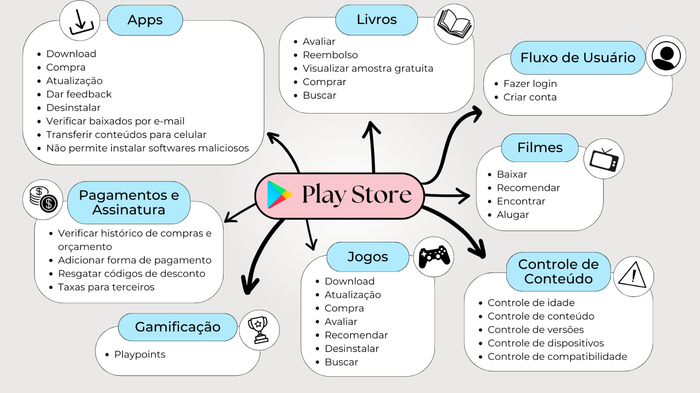

# Geral

Esta seção é destinada para a pré-rastreabilidade dos requisitos gerais da Play Store, esta categoria mostra uma visão completa do aplicativo escolhido.

## [Rich picture](pre-ras.md#rich-picture)

O artefato está definido em [rich picture](../pre-ras/pre-ras.md).

### Versão 1.0
Este é uma versão que tenta representar a Play Store por um ponto de vista de mais alto nível.

*Autores: Hugo Queiroz & Cecilia Quaresma*

## [Mapa Mental](pre-ras.md#mapa-mental)

O artefato está definido em [mapa mental](../pre-ras/pre-ras.md).

### Versão 1.0
Este é uma versão que tenta representar a Play Store por um ponto de vista de mais alto nível e suas funcionalidades.

*Autor: Larissa Vieira*

## Histórico de Versões

| Versão | Data       | Alterações Principais                             | Autor        |
|--------|------------|---------------------------------------------------|--------------|
| 1.0.0  | 31-07-2024 | Lançamento inicial da documentação.               |Carlos Alves,Hugo Queiroz ,Larissa Vieira e Arthur Ribeiro     |

