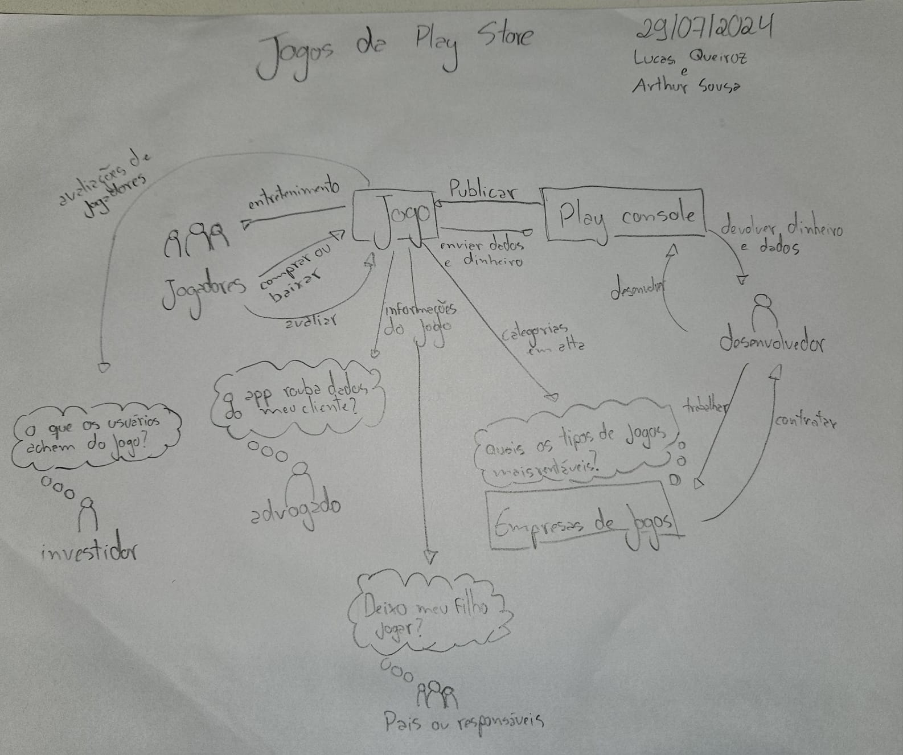

# Jogos

Esta seção é destinada para a pré-rastreabilidade dos requisitos relacionados à área de Jogos da Play Store.

## Histórico de Versões

| Versão | Data       | Alterações Principais                                          | Autor                        |
| ------ | ---------- | -------------------------------------------------------------- | ---------------------------- |
| 1.0    | 31-07-2024 | Realiza divisão do arquivo em elicitação e pré-rastreabilidade | Arthur Sousa e Lucas Queiroz |

## Rich picture
(inserir link para explicação da técnica)

### Versão 1.0

Método: desenho à mão

_Fonte: autores_
