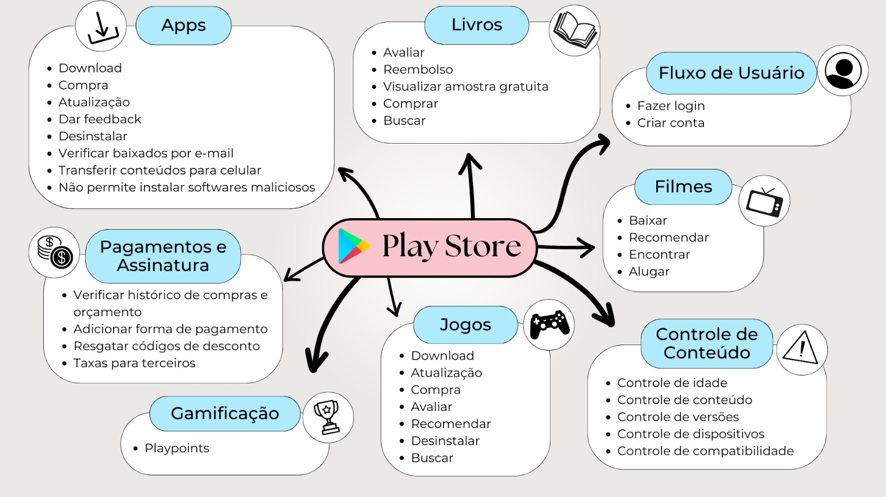

# Pré-rastreabilidade

## Rich Picture:
Um Rich Picture é uma ferramenta visual usada para representar de maneira clara e compreensível a complexidade de uma situação ou sistema. Ele inclui desenhos, símbolos e texto para ilustrar componentes, interações e contextos de forma não linear. O Rich Picture facilita a visualização e a discussão de problemas e soluções, promovendo uma compreensão compartilhada entre diferentes partes interessadas. Além disso, não possui regras rígidas e pode ser feito de maneira livre.

### Geral
#### Versão 01
Este é uma versão que tenta representar a Play Store de uma forma mais geral

*Autores: Hugo Queiroz & Cecilia Quaresma*

## Mapa Mental:
Um mapa mental é uma representação gráfica utilizada para organizar e visualizar informações de forma estruturada e intuitiva. Ele ajuda na organização do pensamento e na exploração de ideias relacionadas a um tema específico. O mapa mental é composto por um tema central, que é o ponto de partida, e ramificações que se expandem a partir deste tema, representando subtemas e ideias associadas.

### Geral
#### Versão 01
Este é uma versão que tenta representar a Play Store de uma forma mais geral e suas funcionalidades.

*Autor: Larissa Vieira*

# Histórico de Versões
| Versão | Data       | Alterações Principais                             | Autor        |
|--------|------------|---------------------------------------------------|--------------|
| 1.0.0  | 25-07-2024 | Lançamento inicial da documentação.               | Carlos Alves      |
| 1.0.1  | 25-07-2024 | Adicionando  Rich Picture geral.               | Carlos Alves      |
| 1.0.2  | 25-07-2024 | Adicionando  Mapa Mental geral.               | Carlos Alves      |

