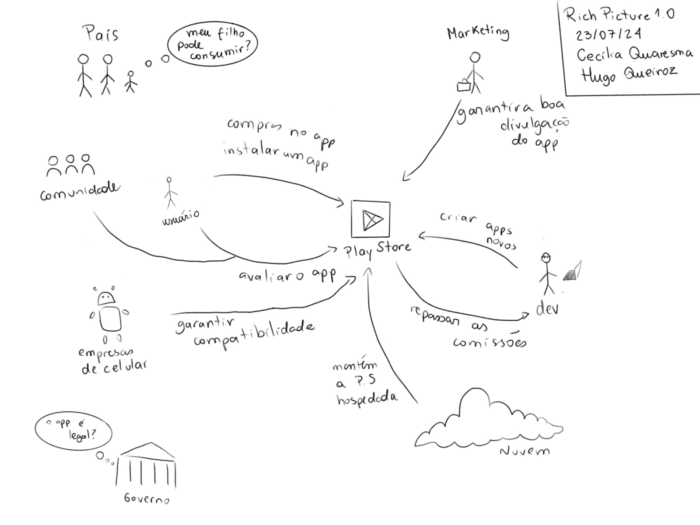

## Rich Picture:
Um Rich Picture é uma ferramenta visual usada para representar de maneira clara e compreensível a complexidade de uma situação ou sistema. Ele inclui desenhos, símbolos e texto para ilustrar componentes, interações e contextos de forma não linear. O Rich Picture facilita a visualização e a discussão de problemas e soluções, promovendo uma compreensão compartilhada entre diferentes partes interessadas. Além disso, não possui regras rígidas e pode ser feito de maneira livre.

### Versão 01
Este é uma versão que tenta representar a Play Store de uma forma mais geral

*Autores: Hugo Queiroz & Cecilia Quaresma*

# Histórico de Versões
| Versão | Data       | Alterações Principais                             | Autor        |
|--------|------------|---------------------------------------------------|--------------|
| 1.0.0  | 25-07-2024 | Lançamento inicial da documentação.               | Carlos Alves      |
