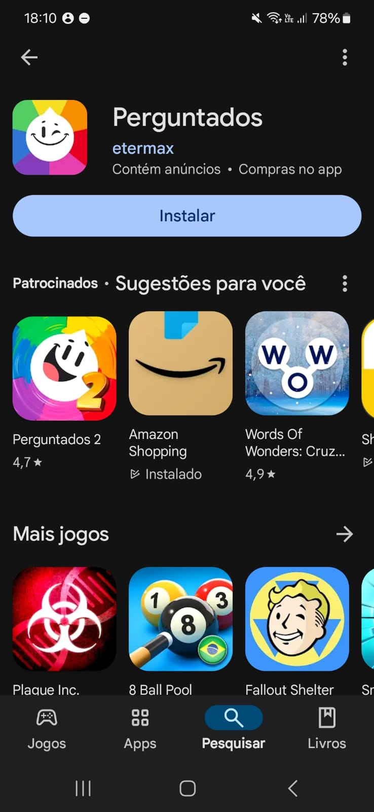
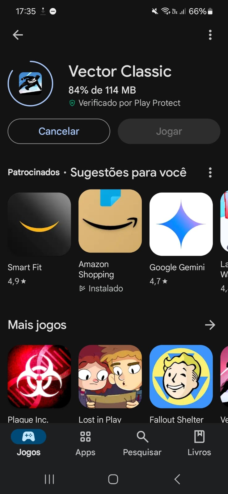

# Pós rastreabilidade

Como não implementemos só utilizamos a técnica de engenharia reversa, desenvolvemos está secção para mostrar como aquele requisito é implementado na Play Store.

 Para isto realizamos a análise dos requisitos e das histórias de usuário, capturamos imagens do aplicativo em funcionamento na Play Store. Essas capturas de tela foram utilizadas para ilustrar o projeto de maneira clara, proporcionando exemplos práticos do sistema em operação. Essa abordagem facilita a visualização dos requisitos implementados, conectando teoria e prática e ajudando a validar o cumprimento das expectativas do usuário final.

## [US01](../modelagem/agil/criterio.md)

## [US02](../modelagem/modelagem/agil/criterio.md)

## [US03](../modelagem/modelagem/agil/criterio.md)

## [US04](../modelagem/modelagem/agil/criterio.md)

## [US05](../modelagem/modelagem/agil/criterio.md)

## [US06](../modelagem/modelagem/agil/criterio.md) e [US07](../modelagem/modelagem/agil/criterio.md)

## [US08](../modelagem/modelagem/agil/criterio.md)

## [US09](../modelagem/modelagem/agil/criterio.md)

## [US10](../modelagem/modelagem/agil/criterio.md)

## [US11](../modelagem/modelagem/agil/criterio.md)

## [US12](../modelagem/modelagem/agil/criterio.md)

## [US13](../modelagem/modelagem/agil/criterio.md)

## [US14](../modelagem/modelagem/agil/criterio.md)

## [US15](../modelagem/modelagem/agil/criterio.md)

## [US16](../modelagem/modelagem/agil/criterio.md)

## [US17](../modelagem/modelagem/agil/criterio.md)

## Histórico de Versões

| **Versão** | **Data**   | **Alterações Principais**                                                 | **Autor**                                                                                  |
| :---: | :---: | :---: | :----: |
| 1.0.0      | 05-09-2024 | Criação do documento e adição das fotos | Arthur Ribeiro, Carlos Alves, Cecília Quaresma, Hugo Queiroz, Larissa Vieira e Lucas Queiroz |