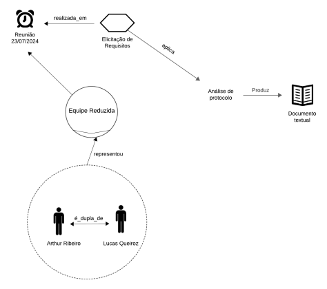

# Reunião 03
Reunião para elicitação geral dos requisitos da Play Store.

Data:  23/07/2024 

Local: FGA

## Membros Presentes:
<form>
  <ul>
    <li><input type="checkbox" id="membro1" checked disabled ><label for="membro1"> Arthur Ribeiro</label></li>
    <li><input type="checkbox" id="membro2" disabled><label for="membro2"> Carlos Alves</label></li>
    <li><input type="checkbox" id="membro3" disabled><label for="membro3"> Cecília Quaresma</label></li>
    <li><input type="checkbox" id="membro4" disabled><label for="membro4"> Hugo Queiroz</label></li>
    <li><input type="checkbox" id="membro4" disabled><label for="membro4"> Larissa Vieira</label></li>
    <li><input type="checkbox" id="membro4" checked disabled><label for="membro4"> Lucas Queiroz</label></li>
  </ul>
</form>

## [Itrace](reunioes.md#itrace):
Pode se observar a técnica em [Itrace](reunioes.md#itrace)

*Autores: Lucas Queiroz e Arthur Ribeiro*

## link da reunião:
A reunião não foi gravada, mas foi gerado um documento de texto com os seus resultados. 

[Arquivo de texto](https://drive.google.com/drive/folders/1G4G9lKh6nn4fyJz-xuYQs_J9-JSvwZZA?usp=sharing).

## Histórico de Versões

| Versão | Data       | Alterações Principais                             | Autor        |
|--------|------------|---------------------------------------------------|--------------|
| 1.0.0  | 21-08-2024 | Criação do arquivo | Lucas Queiroz e Arthur Ribeiro |