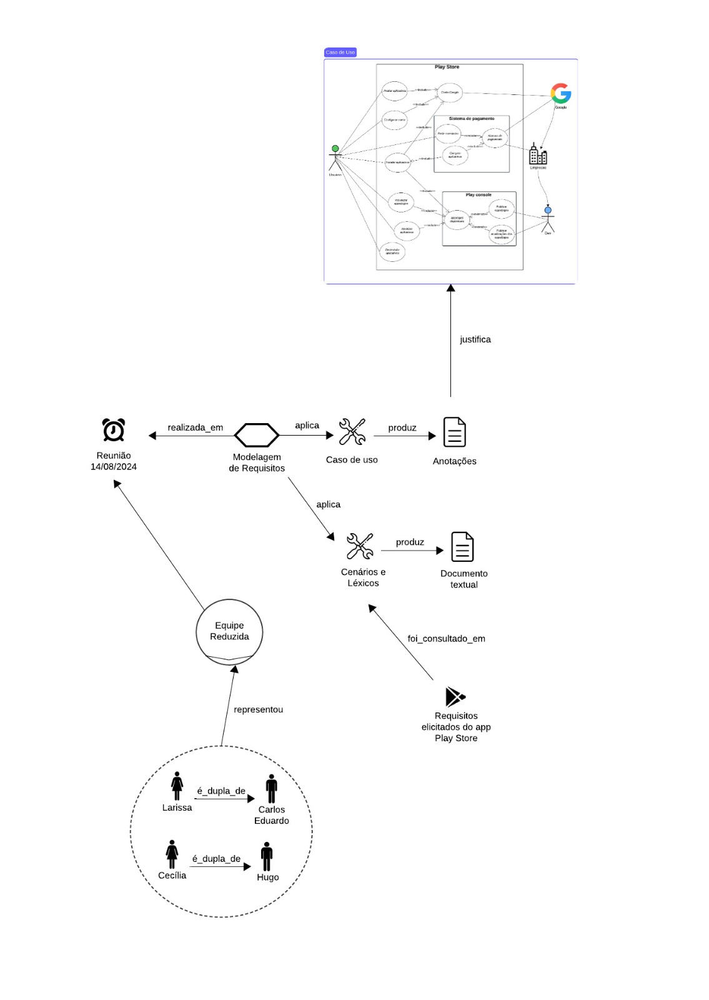

# Reunião 07
Reunião para modelar cenário e léxico da área de apps e jogos, estas categorias foram definidas na secção [Home](../home/home.md).

Data:  15/08/2024 

Local: Discord

## Membros Presentes:
<form>
  <ul>
    <li><input type="checkbox" id="membro1" ><label for="membro1"> Arthur Ribeiro</label></li>
    <li><input type="checkbox" id="membro2" checked><label for="membro2"> Carlos Alves</label></li>
    <li><input type="checkbox" id="membro3" checked><label for="membro3"> Cecília Quaresma</label></li>
    <li><input type="checkbox" id="membro4" checked><label for="membro4"> Hugo Queiroz</label></li>
    <li><input type="checkbox" id="membro4" checked><label for="membro4"> Larissa Vieira</label></li>
    <li><input type="checkbox" id="membro4" ><label for="membro4"> Lucas Queiroz</label></li>
  </ul>
</form>

## [Itrace](reunioes.md#itrace):
Pode se observar a técnica em [Itrace](reunioes.md#itrace)

*Autores: Larissa Vieira*

## Histórico de Versões

| Versão | Data       | Alterações Principais                             | Autor        |
|--------|------------|---------------------------------------------------|--------------|
| 1.0.0  | 15-08-2024 | Criação do arquivo e adicionando iTraces | Carlos Eduardo e Hugo Queiroz |
